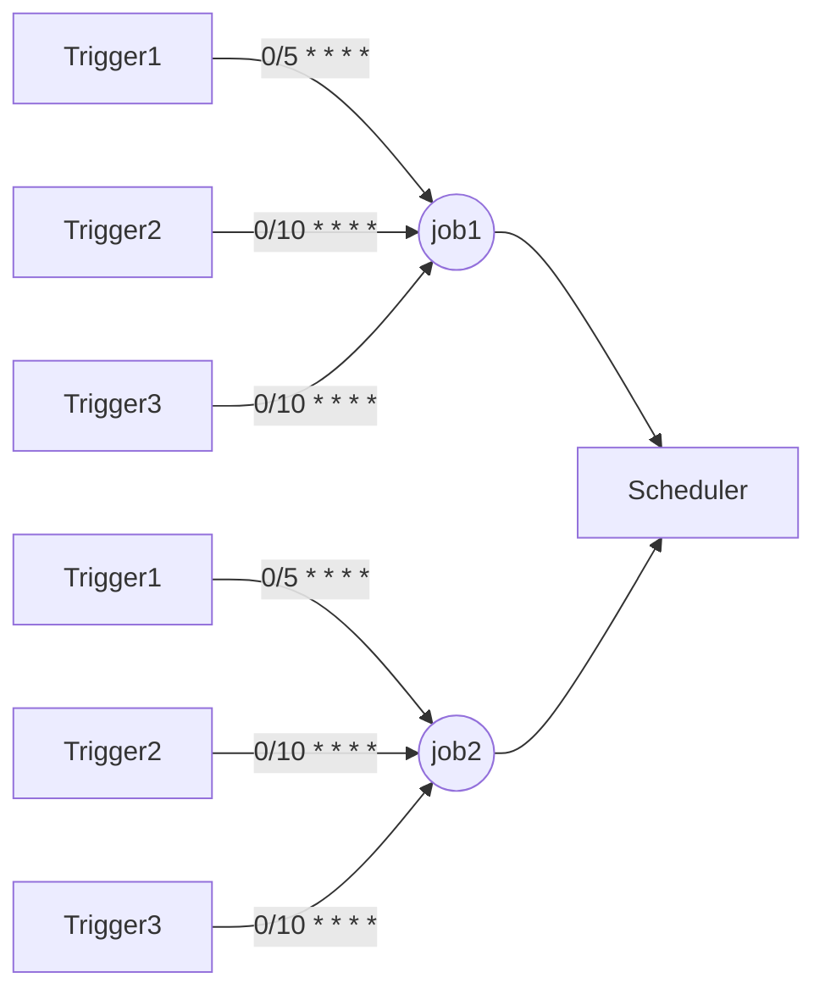

本文介绍的内容为, 在spring管理的项目中使用Quartz2.2.2版本进行任务调度

#### quartz 非教学介绍 

quartz是一款基于java timer开发的一个轻量级任务调度框架, 可以帮助我们快速实现定时/周期任务处理工具组件

 Quartz中有任务组, 任务, 触发器组, 触发器 cron expression 等概念.
 JOB_GROUP 、JOB 、TRIGGER_GROUP 、TRIGGER 、CRON

顾名思义任务组对应任务, 触发器组对应触发器, 目前实战项目中的用法比较特殊.

我们使用一个任务, 对应多个触发器来达到任务调度的实现.当前Quartz支持两种任务配置, 这里使用的是以任务为单位来进行定时执行的概念, 还有一种指定service方法来执行, 具体大家可以参考其他博主的文章自行了解.

<!--more-->

**注意!!! Quartz版本2.x以后,不支持向下兼容, 此文所用Quartz为2.2.2**

#### 常用类及API

JobDetail、JobBuilder、TriggerBuilder、Scheduler、CronTrigger、CronScheduleBuilder

##### 相互之间的关系
任务调度器 Scheduler 内可以存在多个任务 JobDetail 任务内可以存在多个触发器来调起这个任务来进行任务的执行



##### JobDetail
任务的最小单元。该类主要记录任务信息

##### Trigger
任务的执行时机，触发的时点

##### 代码示例
>创建一个任务

```java
/*
 * Quartz 2.x 以后版本,JobDetail由类, 上升成为了接口,对应的实现为JobDetailImpl
 * 但Quartz并不推荐使用JobDetailImpl直接获取到Job对象
 * Quartz提供了构建者模式创建对象
 * 其中包含这里看到的任务构建器, 以及后面得到触发器构建器
 *
 * 这里说明一下构建器的几个参数, 通过阅读源码我们可以发现,
 * Job构建器需要指定一个任务的class路径作为一个构建者的标注, 然后依次属性durably
 * 任务是否进行持久化, 默认为false, 这里后面我们可以通过观察qrtz_job_details中is_durably字段
 * 数据变化来检查对应任务的设置情况. 接着requestRecovery属性为是否记录任务执行状态,
 * 比如中断后, 重启应用后是否继续执行,默认为false,对应表字段qrtz_job_details中 request_recovery字段
 * 接着后面的 withIdentity 为我们任务的基本信息, 分别为任务名称及任务组
 */
JobDetail jobDetail = JobBuilder.newJob(xsdsJob.getClass())
        .storeDurably().requestRecovery().
                withIdentity(xsdsJob.getJobName(), xsdsJob.getJobGroupName()).build();
try {
    scheduler.addJob(jobDetail, true);
} catch (SchedulerException e) {
    ........
}
```

>为某个任务增加执行时机(触发器)

具体内容参考代码中日志

```java
  try {
  	  // TriggerKey  是作为一个触发器的标识存在的, 通过 TriggerKey 可以定位到一个触发器, 这里使用的参数为触发器所在组及触发器名称
      TriggerKey triggerKey = TriggerKey.triggerKey(trigger.getTriggerName(), trigger.getTriggerGroupName());
	  // 通过使用调度器 scheduler.getTrigger() 方法返回值来获取对应的触发器
      if (scheduler.getTrigger(triggerKey) != null) {
          logger.error("当前任务【" + trigger.getTriggerName() + "】已存在, 无法覆盖创建任务调度计划");
          return;
      }
	  // 触发器构建器
      TriggerBuilder<Trigger> triggerBuilder = TriggerBuilder.newTrigger();
      // 执行时辅助参数
      triggerBuilder.usingJobData(trigger.getParam());
      // 触发器信息
      triggerBuilder.withIdentity(trigger.getTriggerName(), trigger.getTriggerGroupName());
      // 设置后立即启动
      triggerBuilder.startNow();
      // 使用的调度类型, 这里配置为cron表达式触发器
      triggerBuilder.withSchedule(
              CronScheduleBuilder.cronSchedule(trigger.getCron())
                      .withMisfireHandlingInstructionDoNothing());
      // 该触发器所关联的任务
      triggerBuilder.forJob(trigger.getJobName(), trigger.getJobGroupName());
      CronTrigger cronTrigger = (CronTrigger) triggerBuilder.build();
      // 设置触发器
      scheduler.scheduleJob(cronTrigger);
      // 当前调度器是否执行, 如果没执行, 启动该调度器
      if (!scheduler.isShutdown()) {
          scheduler.start();
          logger.info("【" + trigger.getTriggerName() + "】任务调度计划启动成功!");
      }
  } catch (Exception e) {
      throw new RuntimeException(e);
  }
```

#### 代码编写参考
>下面一切内容皆建立在Spring管理项目基础上Quartz相关内容

###### jar包下载
maven
```
        <dependency>
            <groupId>org.quartz-scheduler</groupId>
            <artifactId>quartz</artifactId>
            <version>2.2.2</version>
        </dependency>
```

###### 配置Quartz文件

1. 注册调度bean

```java
    <!-- 定时任务配置 -->
    <bean id="scheduler" class="org.springframework.scheduling.quartz.SchedulerFactoryBean">
        <property name="dataSource" ref="dataSource"/>
        <property name="overwriteExistingJobs" value="true"/>
        <property name="startupDelay" value="10"/>
        <property name="autoStartup" value="true"/>
        <property name="applicationContextSchedulerContextKey" value="applicationContextKey"/>
        <property name="configLocation" value="classpath:conf/common/properties/quartz.properties"/>
    </bean>

```

2. Quartz properties(官方默认即可)


```

# Default Properties file for use by StdSchedulerFactory
# to create a Quartz Scheduler Instance, if a different
# properties file is not explicitly specified.
#
org.quartz.scheduler.instanceName=XSDSQuartzScheduler
org.quartz.scheduler.instanceId=AUTO
org.quartz.scheduler.rmi.export=false
org.quartz.scheduler.rmi.proxy=false
org.quartz.scheduler.wrapJobExecutionInUserTransaction=false
org.quartz.threadPool.class=org.quartz.simpl.SimpleThreadPool
org.quartz.threadPool.threadCount=20
org.quartz.threadPool.threadPriority=5
org.quartz.threadPool.threadsInheritContextClassLoaderOfInitializingThread=true
#60000
org.quartz.jobStore.misfireThreshold=120000

#org.quartz.jobStore.class = org.quartz.simpl.RAMJobStore
org.quartz.jobStore.class=org.quartz.impl.jdbcjobstore.JobStoreTX
#org.quartz.jobStore.driverDelegateClass = org.quartz.impl.jdbcjobstore.StdJDBCDelegate
org.quartz.jobStore.driverDelegateClass=com.erayt.xsds.common.schedule.core.OracleDelegate
org.quartz.jobStore.useProperties=false
#org.quartz.jobStore.dataSource = myDS
org.quartz.jobStore.tablePrefix=QRTZ_
org.quartz.jobStore.isClustered=true
org.quartz.jobStore.clusterCheckinInterval=30000
org.quartz.jobStore.maxMisfiresToHandleAtATime=10
#org.quartz.jobStore.doubleCheckLockMisfireHandler=false


```

###### 代码部分

```java
package com.erayt.xsds.common.schedule.core;

import com.erayt.xsds.common.cache.ehcache.cachedOb.SysParamList;
import com.erayt.xsds.common.domain.base.SysParam;
import com.erayt.xsds.common.utils.CronUtil;
import org.apache.log4j.Logger;
import org.quartz.*;
import org.springframework.beans.factory.annotation.Value;
import org.springframework.stereotype.Service;

import javax.annotation.Resource;

/**
 * @author lvgo
 * @version 1.0
 * @package com.erayt.xsds.common.schedule.service
 * @description: 定时任务调度管理
 * @date 2019/9/18 16:00
 */
@Service
public class ScheduleService {

    public static final String TRG_BATCHTODAY = "当日晚间批处理任务";
    public static final String TRG_SYSBATCH = "系统隔夜批处理任务";
    public static final String TRG_SYSONLINEBATCH = "系统联机隔夜批处理任务";

    private static Logger logger = Logger.getLogger(ScheduleService.class);
    @Value("${TRG_GROUP_NAME}")
    public String triggerGroupName = "TRIGGER_GROUP_SYSTEM";
    @Resource
    private XsdsJob xsdsJob;
    @Resource
    private Scheduler scheduler;

    public void setDemoSchedule() {
        String cron = CronUtil.getCron(1, 0, 10, 0);
        addTrigger(getXsdsJobTrigger("这是一个测试任务", cron, "type", 1000));
    }

    /**
     * 创建一个xsds任务
     */
    public void createXsdsJob() {
        JobDetail jobDetail = JobBuilder.newJob(xsdsJob.getClass())
                .storeDurably().requestRecovery().
                        withIdentity(xsdsJob.getJobName(), xsdsJob.getJobGroupName()).build();
        try {
            scheduler.addJob(jobDetail, true);
        } catch (SchedulerException e) {
            logger.error("增加XSDS基本任务异常", e);
        }
    }

    /**
     * 获取一个XSDS任务触发器对象
     *
     * @param name 创建的任务名称
     * @param cron 任务执行时间
     * @return 任务执行触发器
     */
    public XsdsJobTrigger getXsdsJobTrigger(String name, String cron) {
        return new XsdsJobTrigger.Builder().jobGroupName(xsdsJob.getJobGroupName()).jobName(xsdsJob.getJobName())
                .triggerGroupName(triggerGroupName).triggerName(name).cron(cron);
    }

    public XsdsJobTrigger getXsdsJobTrigger(String name, String cron, String paramKey, Object paramValue) {
        return new XsdsJobTrigger.Builder().jobGroupName(xsdsJob.getJobGroupName()).jobName(xsdsJob.getJobName())
                .triggerGroupName(triggerGroupName).triggerName(name).cron(cron).params(paramKey, paramValue);
    }

    /**
     * 增加一个任务执行触发器
     *
     * @param trigger 任务执行触发器
     */
    public void addTrigger(AbstractTrigger trigger) {
        try {
            TriggerKey triggerKey = TriggerKey.triggerKey(trigger.getTriggerName(), trigger.getTriggerGroupName());
            if (scheduler.getTrigger(triggerKey) != null) {
                logger.error("当前任务【" + trigger.getTriggerName() + "】已存在, 无法覆盖创建任务调度计划");
                return;
            }
            TriggerBuilder<Trigger> triggerBuilder = TriggerBuilder.newTrigger();
            triggerBuilder.usingJobData(trigger.getParam());
            triggerBuilder.withIdentity(trigger.getTriggerName(), trigger.getTriggerGroupName());
            triggerBuilder.startNow();
            triggerBuilder.withSchedule(
                    CronScheduleBuilder.cronSchedule(trigger.getCron())
                            .withMisfireHandlingInstructionDoNothing());
            triggerBuilder.forJob(trigger.getJobName(), trigger.getJobGroupName());
            CronTrigger cronTrigger = (CronTrigger) triggerBuilder.build();
            scheduler.scheduleJob(cronTrigger);
            if (!scheduler.isShutdown()) {
                scheduler.start();
                logger.info("【" + trigger.getTriggerName() + "】任务调度计划启动成功!");
            }
        } catch (Exception e) {
            throw new RuntimeException(e);
        }
    }

    /**
     * 修改一个任务的触发时间
     *
     * @param xsdsJob xsds任务类 提供触发器组, 触发器名称, 修改后的cron表达式
     */
    public void modifyJobTime(AbstractTrigger xsdsJob) {
        try {
            TriggerKey triggerKey = TriggerKey.triggerKey(xsdsJob.getTriggerName(),
                    xsdsJob.getTriggerGroupName());
            CronTrigger trigger = (CronTrigger) scheduler.getTrigger(triggerKey);
            if (trigger == null) {
                return;
            }
            String oldTime = trigger.getCronExpression();
            if (!oldTime.equalsIgnoreCase(xsdsJob.getCron())) {
                TriggerBuilder<Trigger> triggerBuilder = TriggerBuilder.newTrigger();
                triggerBuilder.forJob(xsdsJob.getJobName(), xsdsJob.getJobGroupName());
                triggerBuilder.withIdentity(xsdsJob.getTriggerName(), xsdsJob.getTriggerGroupName());
                triggerBuilder.startNow();
                triggerBuilder.usingJobData(trigger.getJobDataMap());
                triggerBuilder.withSchedule(CronScheduleBuilder.cronSchedule(xsdsJob.getCron()));
                trigger = (CronTrigger) triggerBuilder.build();
                scheduler.rescheduleJob(triggerKey, trigger);
                logger.info("【" + xsdsJob.getTriggerName() + "】任务调度计划重设成功!");
            }
        } catch (Exception e) {
            throw new RuntimeException(e);
        }
    }

    /**
     * 移除一个任务
     *
     * @param xsdsJob xsds 任务类 提供任务名称, 任务组, 触发器名称, 触发器组
     */
    public void removeJob(AbstractTrigger xsdsJob) {
        try {
            TriggerKey triggerKey = TriggerKey.triggerKey(xsdsJob.getTriggerName(), xsdsJob.getTriggerGroupName());
            scheduler.pauseTrigger(triggerKey);
            scheduler.unscheduleJob(triggerKey);
            scheduler.deleteJob(JobKey.jobKey(xsdsJob.getJobName(), xsdsJob.getJobGroupName()));
        } catch (Exception e) {
            throw new RuntimeException(e);
        }
    }

    /**
     * 启动所有定时任务
     */
    public void startJobs() {
        try {
            scheduler.start();
            logger.info("任务调度计划启动成功");
        } catch (Exception e) {
            throw new RuntimeException(e);
        }
    }

    /**
     * 关闭所有定时任务
     */
    public void shutdownJobs() {
        try {
            if (!scheduler.isShutdown()) {
                scheduler.shutdown();
                logger.info("任务调度计划停止成功");
            }
        } catch (Exception e) {
            throw new RuntimeException(e);
        }
    }
}
```

```java
package com.erayt.xsds.common.schedule.core;

import org.quartz.JobDataMap;

/**
 * @author lvgo
 * @version 1.0
 * @package com.erayt.xsds.common.schedule.core
 * @description: 触发器标识基础抽象类
 * @date 2019/9/19 14:11
 */
public abstract class AbstractTrigger {

    /**
     * 获取触发器名称
     *
     * @return 触发器名称
     */
    public abstract String getTriggerName();

    /**
     * 获取触发器组名称
     *
     * @return 触发器组名称
     */
    public abstract String getTriggerGroupName();

    /**
     * 获取cron表达式 执行时机
     *
     * @return cron表达式
     */
    public abstract String getCron();

    /**
     * 获取任务名称
     *
     * @return 任务名称
     */
    public abstract String getJobName();

    /**
     * 获取任务组名称
     *
     * @return 任务组名称
     */
    public abstract String getJobGroupName();

    /**
     * 获取任务执行所需参数, 假如需要的话
     *
     * @return 任务执行所需参数
     */
    public abstract JobDataMap getParam();
}

```

```java
package com.erayt.xsds.common.schedule.core;

import com.erayt.solar2.engine.query.QueryParam;
import com.erayt.solar2.engine.query.impl.QueryEngineImpl;
import com.erayt.xsds.common.domain.base.SysParam;
import com.erayt.xsds.common.schedule.batch.FinancialOverNight;
import com.erayt.xsds.common.schedule.batch.LogInfoUtil;
import com.erayt.xsds.common.schedule.service.SysParamService;
import org.apache.log4j.Logger;
import org.quartz.JobDataMap;
import org.quartz.JobExecutionContext;
import org.quartz.JobExecutionException;
import org.quartz.SchedulerException;
import org.quartz.impl.triggers.CronTriggerImpl;
import org.springframework.beans.factory.annotation.Value;
import org.springframework.scheduling.quartz.QuartzJobBean;
import org.springframework.stereotype.Component;
import org.springframework.web.context.support.XmlWebApplicationContext;

/**
 * @author lvgo
 * @version 1.0
 * @package com.erayt.xsds.common.schedule.batch
 * @description: xsds job 类
 * @date 2019/9/19 10:06
 */
@Component
public class XsdsJob extends QuartzJobBean {

    private Logger logger = Logger.getLogger(XsdsJob.class);
    private Logger loggerBatch = Logger.getLogger(XsdsJob.class);

    /**
     * 任务名称
     */
    @Value("${XSDS_JOB}")  // 这里读取的是配置文件, 有需要自行调整
    private String jobName;
    /**
     * 任务组名称
     */
    @Value("${JOB_GROUP_NAME}") // 这里读取的是配置文件, 有需要自行调整
    private String jobGroupName;

    public String getJobName() {
        return jobName;
    }

    public String getJobGroupName() {
        return jobGroupName;
    }

    @Override
    protected void executeInternal(JobExecutionContext currentJob) throws JobExecutionException {
        QueryEngineImpl queryEngine = null;
        SysParamService sysParamService = null;
        FinancialOverNight financialOverNight = null;
        try {
            XmlWebApplicationContext context = (XmlWebApplicationContext) currentJob
                    .getScheduler().getContext().get("applicationContextKey");
            queryEngine = (QueryEngineImpl) context.getBean("queryEngine");
            sysParamService = (SysParamService) context.getBean("sysParamService");
            financialOverNight = (FinancialOverNight) context.getBean("financialOverNight");
        } catch (SchedulerException e) {
            e.printStackTrace();
        }
        CronTriggerImpl trigger = (CronTriggerImpl) currentJob.getTrigger();
        logger.info("任务调度执行计划【" + trigger.getName() + "】已启动");
        JobDataMap jobDataMap = trigger.getJobDataMap();
        Integer type = (Integer) jobDataMap.get("type");
        logger.info("当前执行任务type:" + type);
        switch (type) {
            case 1000:
               System.out.println("测试任务正常执行");
                break;
            default:
                break;
        }
        logger.info("任务调度执行计划【" + trigger.getName() + "】已结束");
    }
}

```

```java
package com.erayt.xsds.common.schedule.core;

import org.quartz.JobDataMap;

import java.util.Map;

/**
 * @author lvgo
 * @version 1.0
 * @package com.erayt.xsds.common.schedule.core
 * @description: xpad基础任务新增触发器类 通过 Builder 方法创建
 * @date 2019/9/19 14:01
 */
public class XsdsJobTrigger extends AbstractTrigger {

    /**
     * 任务名称
     */
    private String jobName;
    /**
     * 任务组名称
     */
    private String jobGroupName;
    /**
     * 触发器名称
     */
    private String triggerName;
    /**
     * 触发器组名称
     */
    private String triggerGroupName;
    /**
     * cron 表达式
     */
    private String cron;
    /**
     * 参数
     */
    private JobDataMap param = new JobDataMap();

    /**
     * 建议使用builder创建xsdsJOb触发器
     */
    private XsdsJobTrigger() {
    }

    @Override
    public String getJobName() {
        return jobName;
    }

    @Override
    public String getJobGroupName() {
        return jobGroupName;
    }

    @Override
    public String getTriggerName() {
        return triggerName;
    }

    @Override
    public String getTriggerGroupName() {
        return triggerGroupName;
    }

    @Override
    public String getCron() {
        return cron;
    }

    @Override
    public JobDataMap getParam() {
        return param;
    }

    public static class Builder extends XsdsJobTrigger {
        public Builder jobName(String jobName) {
            super.jobName = jobName;
            return this;
        }

        public Builder jobGroupName(String jobGroupName) {
            super.jobGroupName = jobGroupName;
            return this;
        }

        public Builder triggerName(String triggerName) {
            super.triggerName = triggerName;
            return this;
        }

        public Builder triggerGroupName(String triggerGroupName) {
            super.triggerGroupName = triggerGroupName;
            return this;
        }

        public Builder cron(String cron) {
            super.cron = cron;
            return this;
        }

        public Builder params(Map<String, Object> param) {
            super.param = new JobDataMap(param);
            return this;
        }

        public Builder params(String key, Object value) {
            super.param.put(key, value);
            return this;
        }

        public Builder build() {
            return this;
        }
    }
}


```
